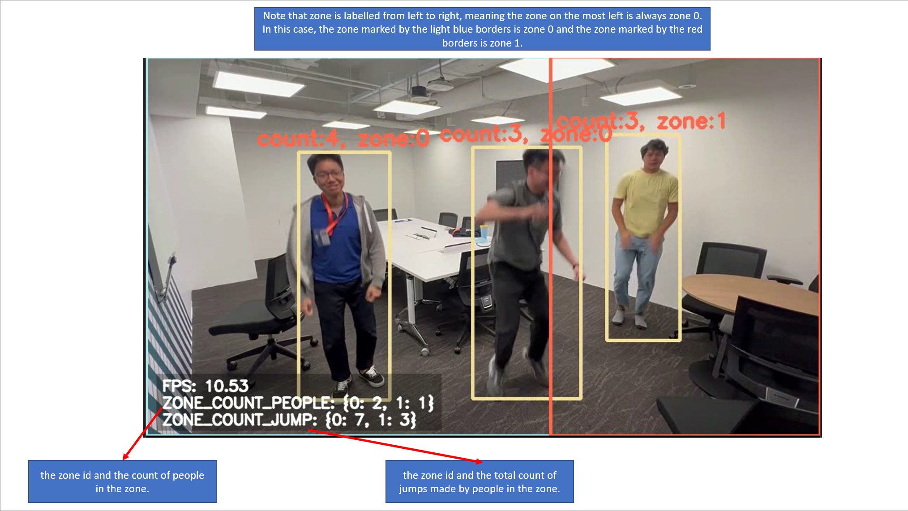

# pkd demo

# Introduction
To implement a gamified exercise inference pipeline, which counts the number of tuck jumps completed by individuals within the video feed. Scores can also be aggregated by "zones" that are pre-determined by users, which could introduce some level of team competitiveness into the game. At the very least, the pipeline should still serve as a regular jump counter for a fitness enthusiast, using an easy to set up script. 


*(gif of man doing tuck jumps)*

The inference pipeline has been implemented on PeekingDuck, an open-source, modular framework in Python, built for Computer Vision (CV) inference. The repository is built and managed by the CV Hub team in AI Singapore. 

# Installation
```
> pip install peekingduck
```
For more detailed installation instructions, please refer to the [official PeekingDuck documentations](https://peekingduck.readthedocs.io/en/stable/getting_started/02_standard_install.html#install-peekingduck).

# Pipeline Composition

### Custom Nodes
Name of custom node | Description | 
--- | --- |
dabble.timer | Measure time taken object has been in frame | 
dabble.jump | Counts the number of jumps made by detected objects | 
dabble.count_in_zone | Counts the total number of jumps made by objects within a zone | 
<br>

1. [YOLOV4-tiny](https://arxiv.org/abs/2004.10934) is used to first detect the human objects in the video feed. The tiny version of YOLOV4 was intentionally selected (instead of the small/medium/large renditions of the same framework) to minimise the computational cost of running the model inference, which in turn, would maximise FPS. This was a conscious trade-off made due to the nature of the jump counter, which would require a high enough FPS to track jumps well. 

2. Second, the **dabble.tracking** node tracks bounding boxes detected by the YOLOV4 model, using the [IoU tracking algorithm](http://elvera.nue.tu-berlin.de/files/1517Bochinski2017.pdf). Essentially, the IOU tracker associates the current detection with the highest IoU to the last detection in the previous frame. In other words, detections with close proximity to each other in between frames are assumed to be of the same object, and the particular object will be tracked this way. 

3. Third, the custom **dabble.timer** node would track how long (in seconds) since the object was first detected. This is measured by using the time at the current frame, subtracted by the time the object was first detected. 

4. Fourth, the custom **dabble.jump** node would track the number of tuck jumps made by the object, which is a cumulative count since the object was first tracked. A jump is deteced through a helper function which checks if the object has changed directions (upwards or downwards). 

    More specifically, the jump node would store information of the heights of the bounding box of each object for each frame. Then, the helper function looks through the past heights to infer if the object is currently moving upwards or downwards. Height is recorded using the height of the bottom mid point of the bounding box predicted. 

    If object's previous direction was "up" but height has been decreasing, the direction will be reversed to "down", and vice versa. For every "up" and "down" movement made by the object, the jump counter increases by one. 

    For added versatility, the **dabble.jump** node also has a optional threshold config which represents the the number of frames object has to move in the same direction before it is detected to be travelling upwards/ downwards. Setting a lower threshold would make the node more sensitive to detecting jumps, and vice versa. To record smaller jumps, user should reduce the magnitude of threshold. To only record higher jumps, user should increase the magnitude of threshold instead.  

5. Finally, the custom **dabble.count_in_zone** node would classify each detected object into the zones specified in dabble.zone_count. Then, group the jump counts by the zone and sum up to get the total jump count for each zone. 

<br>



This is a screenshot taken from the output of the inference pipeline. The image has been annotated to give more information on how the legend at the bottom left corner should be interpreted. Additionally, the 2 elements presented for each object are (1) total number of jumps recorded for object and (2) the zone the object is assigned to. 

<br>

# Demo


[full output](https://drive.google.com/file/d/1w1CqgR0pEacb6VjU9UuQ75_lGL_3D1u8/view?usp=share_link)

This example also illustrates the importance of the threshold value in **dabble.jump** node, where we have used the threshold value of 5. However, we note that the pipeline is currently over detecting jumps and that a possible solution would be to set a higher threshold through the config of the node.

# Optional Configs

## Labels shown on object
On top of the 3 elements (time, jump count and zone) that are displayed for each object, user can also edit the config file to include the direction of the jump and the height of the object (recorded using bottom mid point of bounding box). To do so, edit the following lines on [pipeline_config.yml](pipeline_config.yml)
```
- draw.tag:
    show: ["times", "jumps", "zones", "directions", "heights"]
```
Similarly, to reduce the clutter on the screen, user can remove keys that they do not want displayed. 

Note that the times key work best if the video source is running live from the webcam. Otherwise, the time recorded depends on how fast the video is processed and may lead to inaccuracte times. 

## Custom video source
Additionally, to run the inference pipeline on a custom video source or even through the webcam of the device, edit the following lines 
```
- input.visual:
    source: 'link/to/vid.mp4' OR 0 # 0 gives the webcam live feed
```
More informaation can be found [here](https://peekingduck.readthedocs.io/en/stable/nodes/input.visual.html).

Hint: remember to also change the resolution config for the **dabble.zone_count** node to correspond to the new video's resolution. Zones config can also be toggled to fit user's preference. More informaation can be found [here](https://peekingduck.readthedocs.io/en/stable/nodes/dabble.zone_count.html#module-dabble.zone_count).

# Possible Use Cases
- Mass exercising sessions (such as during army training), where there are many participants and limited supervisors. This inference pipeline would make it easy to count if all participants have finished the required set of exercises.
- Mass games (such as games played in school camps), where participants are split into groups to compete with one another. 

# Limitations and Future Work
1. Camera angle is important- due to the nature the jumps are tracked (since we are tracking by vertical distance), the camera must be placed such that it is viewing the human objects from the front. If the camera was top-down instead, the change in vertical height captured would be much smaller and the tuck jumps may not be properly detected. 
2. Occluded objects may not be properly tracked- objects are tracked based on IoU, which makes it harder to trace the bounding boxes of each object if there are many overlapping bounding boxes. 

A solution would be to train an action detector model instead, such as the [SlowOnly network](https://openaccess.thecvf.com/content_ICCV_2019/html/Feichtenhofer_SlowFast_Networks_for_Video_Recognition_ICCV_2019_paper.html), which uses both spatial semantics and temporal information to classify actions of objects. Then, use such a model to predict tuck jumps, instead of the current rule-based approach. 
